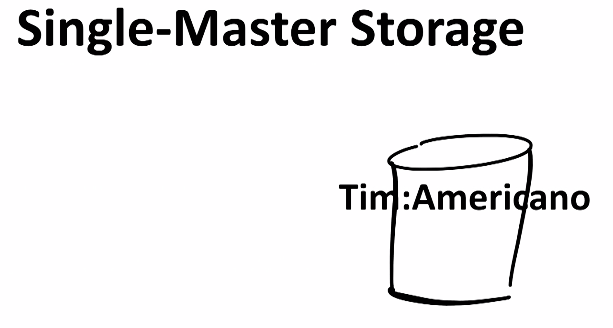
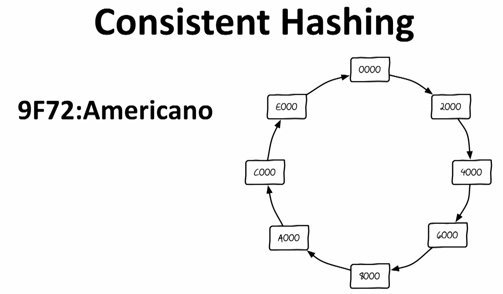
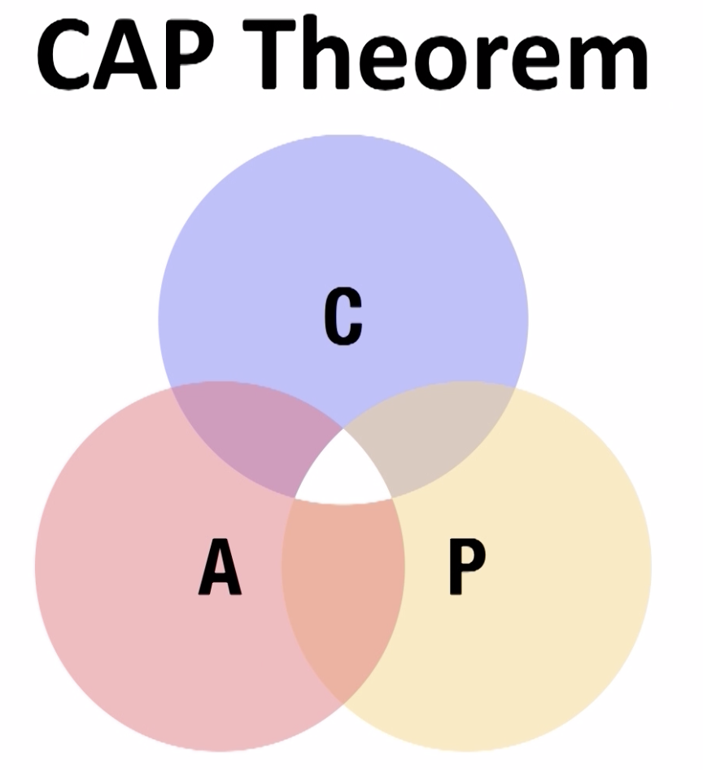

# Distributed Systems (WIP)

> **A distributed system is a collection of independent computers that appear to its users as one computer**

Tanenbaum

**Three characteristics of a distributed system:**

- The computers operate concurrently
- The computers fail independently
- The computers do not share a global clock

This section will cover:

- **Storage**: Relational/Mongo, Cassandra, HDFS
- **Computation**: Hadoop, Spark, Storm
- **Synchronization**: NTP, vector clocks
- **Consensus**: Paxos, Zookeeper
- **Messaging**: Kafka

## Single Master Storage

Setting the scene in a coffee shop we are starting with a non-distributed Single Master storage where we store customers and their favorite coffee:

## Read Replication

This is the first strategy used to scale a Single Master Database.

We can create copies of the database that we have. So there is going to be the main one that will have the information which will then be replicated in the other two replicas of it when there is an update:

There is a problem here though. The 2 new replicas are not necessarily perfectly consistent with each other all the time.

We can handle more read traffic now. But we've introduced a couple of problems:

- **Complexity**
- **Consistency**

Now this isn't the end of the world. And if you are committed to distributed storage. If you need a distributed database you probably are going to be willing to put up with **eventual consistency**. That seems to be the judgment of most architects who build distributed storage systems. Is that they don't really mind that.

Another important characteristic of read replication is that **it is really only solving the problem of there being lots more reads than writes**.

This is a strategy that was developed early on in the history of the web. Because architects discovered that there were _typically lots and lots more reads to web traffic than there were writes_. So writes were a relatively easy problem to manage on a single server. But we wanted to replicate that read traffic to a number of follower nodes that we could use to spread that. So if the balance of your traffic looks like that. If it's a read mostly. Or read heavy workload. Then read replication is your friend.

## Sharding

This is the next step to scaling our storage when the previous does not work anymore.

We are going to split the databases in 3 and still have the same read replication model underneath each "master" database:

Now this again introduces a little bit more **complexity** because now somehow, I have to know, well I'm Tim, let me real quick sing the alphabet song. Okay I'm after N, so I'm in that head barista number three. I have to go there. So there has to be some layer that does that translation of the key and maps it onto a shard.

When we do this in real systems, there's typically a layer in the application that makes this happen.

Again we can handle more write traffic now - three times more than before. But we've introduced a couple of problems:

- **Complexity**
- **We have limited the data model** - there has to be a unique id
- **We have limited data access patterns**

## Consistent Hashing

Let's say we wanted to build our coffee shop for scale from the ground up.

So we are going to use Consistent Hashing often referred as Distributed Hash Table (DHT) or Dynamo-style database.

So the strategy of consistent hashing is hashing the key of the key-value pair

To be able to fix the problem of redundancy we can replicate the data in the next 2 nodes like so:

By doing so we are creating a problem of **consitency** though.

What if when there is an update one of the 3 nodes that were supposed to be updated is down?

There is a formula that answers this question:

> R + W > N

R: number of replicas that agree on a read\
W: number of replicas that successfully take a write\
N: total number of replicas

When to use Cassandra (which uses Consistent Hashing)?

- **Scale**
- **Transactional data** (loads of updates in the storage)
- **Always on**

## CAP Theorem

C: **Consistency**\
A: **Availability**\
P: **Partition Tolerance**

The CAP Theorem has been mathematically proven and what it means is that **there is no way to have all three**.

In a distributed database, in the presence of a network partition, we have that decision to make. Am I gonna be available or am I gonna be consistent?
