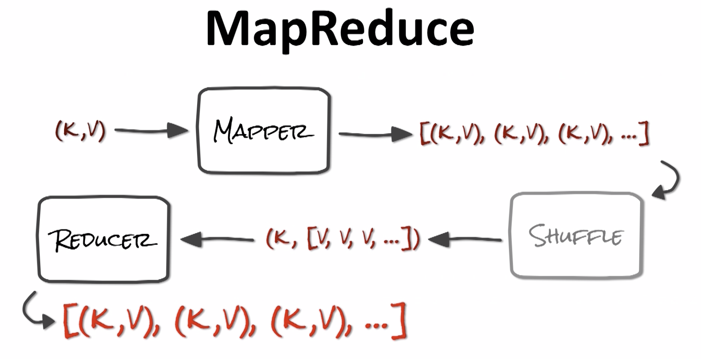
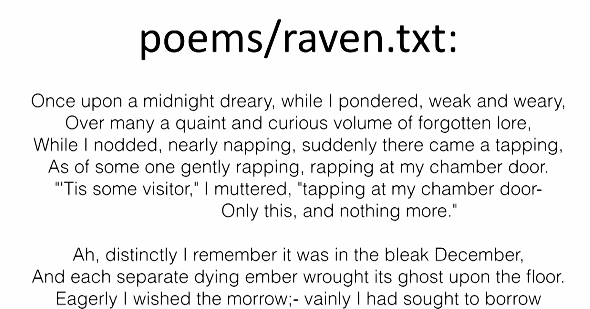
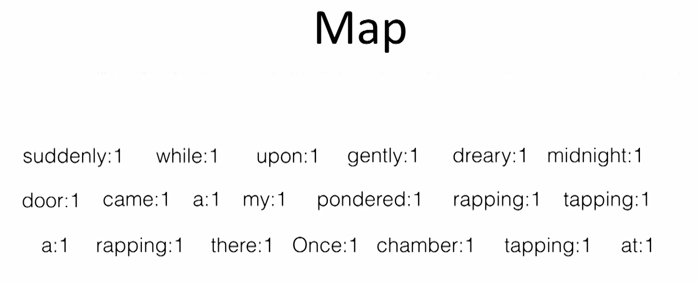
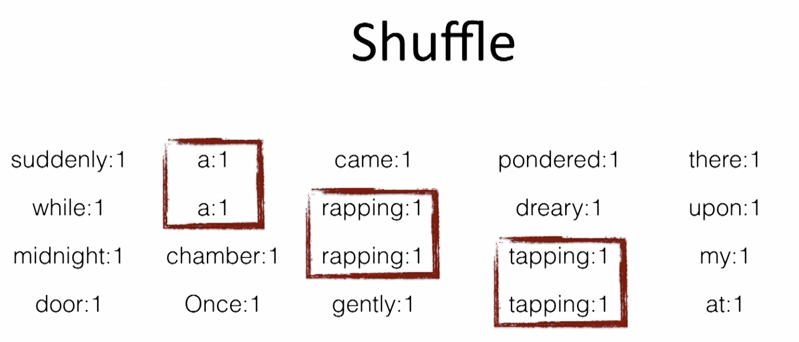
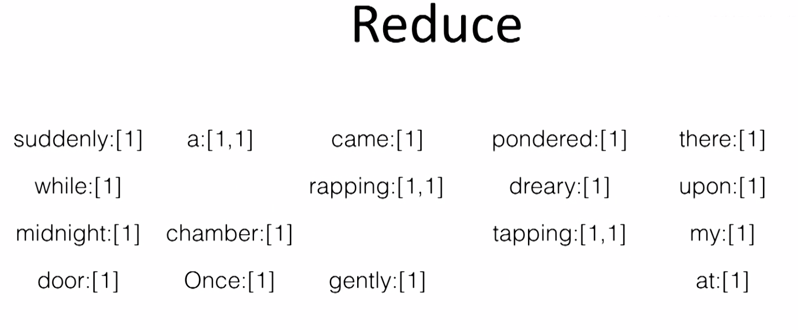

# Computation (WIP)

## Map Reduce

A computation pattern, it's kind of a mathematical abstraction that helps us break problems into the kinds of pieces that lend themselves well to distributed computation.

- All computation in two functions: Map and Reduce
- Keep data (mostly) where it is
- move compute to data

Example using The Raven by Edgar Allan Poe having the key as the name of the file and value its content:

\
\
\
\
