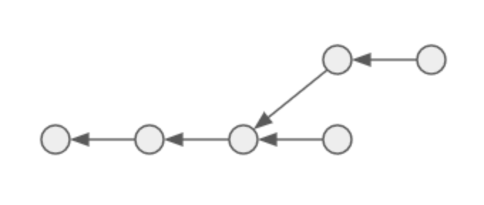
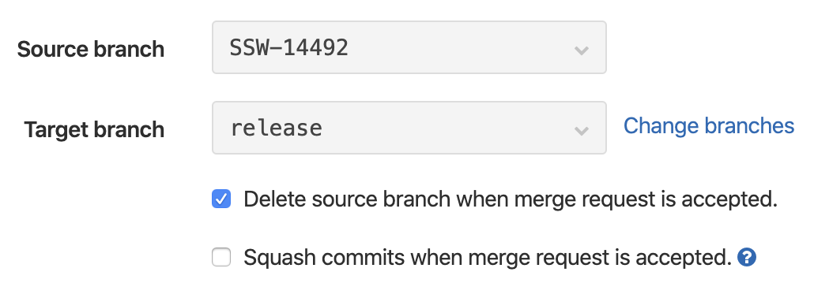
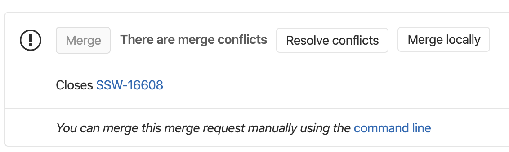
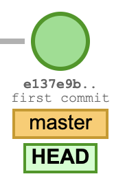
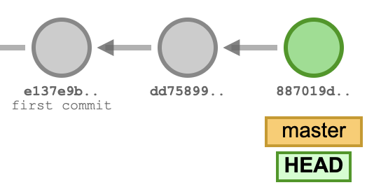
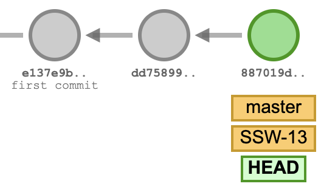
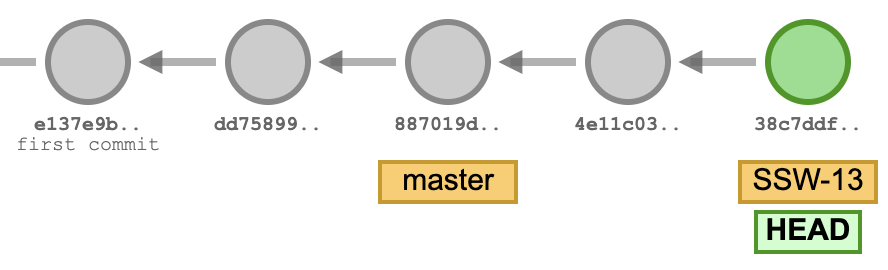
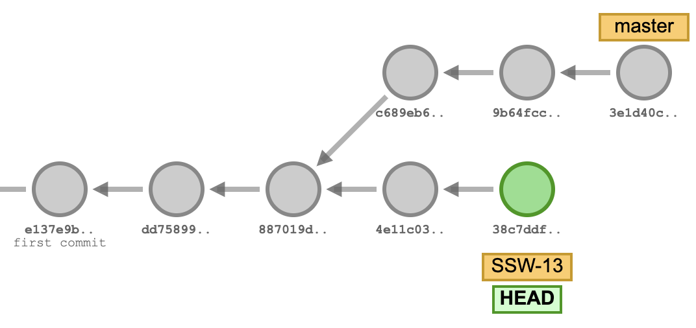
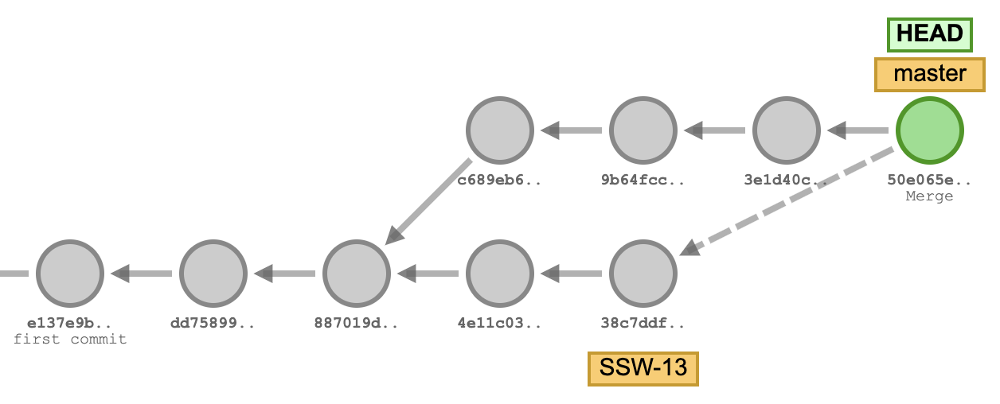
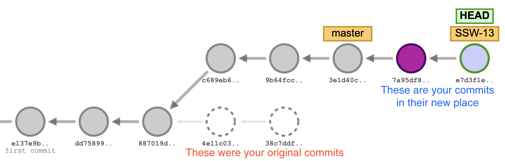

# Git workflow guide

## Introduction

Welcome to this humble tutorial, intended to introduce you to the intricacies of git and guide you through the great seas of git conflicts in safety. This guide assumes that the reader is new to the project (eg. a new joiner to the team) but attempts to provide help with some non-trivial issues and hopefully show something new to more seasoned team members too.

It should be noted that this writing is not intended to be a full git tutorial, I’m only going to explain some of the concepts. If you’re a completely new to git, I recommend reading the [Git book](https://git-scm.com/book/en/v2) or [Atlassian’s Git tutorial](https://www.atlassian.com/git) first. There’s also the amazing [Visualizing Git](https://git-school.github.io/visualizing-git/) tool that lets you, well, visualise git. You must be surprised.

## Git basics

Let’s cover up a few basic things about git that you should understand before proceeding. If you already feel familiar with git, feel free to skip this chapter. I’ll be using the command line in the examples but everything should work exactly the same in your favourite git UI too.

### A few concepts

Git is a **distributed** version control system. It is called distributed because the source repository it manages is stored on every computer that has ever checked the code out. It even calls making a local copy ‘cloning’ because by cloning, you receive a full copy of the repository. Having a full copy of the repository has a couple of advantages, for example you can commit code and make changes even when you’re in the middle of a bear hunt in Alaska without any sort of network connectivity and synchronise later when you’re back in a civilised area.

Being distributed in a way like this also means that there is no central server that is somehow more authoritative than others. But hey, I hear you shout, isn’t Gitlab a central server that is exactly like that? Well, technically no. We use Gitlab as a means to collaborate and it even enforces some rules but from git’s perspective, it’s just another equal node. This implies that if you take your friends to bear hunting, those around you can still push changes to each other if you set up an ad-hoc wifi network in the middle of the forest.

When you create or clone a repository and start to make changes, you’ll need to understand that git has three main areas of work: the **working directory**, the staging area, and the repository. The working directory is where your usual files are and where you prepare your changes by writing code. The **staging area** is an intermediate place where you can place your files and review them before actually committing them. The staging area allows you to pick which of your changes you want to commit and omit the rest. The **repository** is where your staged files are put once you commit them - it is like the written history of all changes.


Imagine yourself at a self-serve restaurant where you put your lunch together from the available veggies, sauces and desserts (working directory), put your selection on a tray (stage) before paying at the counter (committing). And the workers are bears.

Git also has lightweight branches, meaning that it is very cheap to create and maintain branches, so one suggested way of working with git is to create a new branch for each line of work (referred to as a **feature branch**) and merge them once work on them is complete. This allows for a very nice isolation of parallel works, making change management safer and easier.

## The workflow

### Step 0: Make sure everything is clean and up-to-date

So, you have a feature you want to work on, and you’re wondering how to get started? Before doing anything else, you should make sure that you have got the most recent copy of your main branches, i.e. ‘master’ and ‘release'.

```shell
$ git checkout release
$ git pull origin release
 * branch                release    -> FETCH_HEAD
Already up to date.
```

Also, you might want to check if there’s anything left over from a previous work. If your workspace is clean, you should see something like this:

```shell
$ git status
On branch release

Your branch is up to date with 'origin/release'.
```

nothing to commit, working tree clean
Removing unnecessary leftover from a previous work can help in maintaining a hygienic environment. The less clutter you have on your desk, the easier it’ll be to focus on stuff that matters. Note: cleaning up previous work is not strictly necessary but will help you in preventing accidental problems.

### Step 1: Create a feature branch from release

Most people work on N number of things at the same time, where N is a number greater than one. In order to keep those lines of work separated from each other, they should be done on separate branches, each branch dedicated to a single ticket in Jira.

Just when you start working on a new ticket, create a new branch from the ‘**release**’ branch:

```shell
$ git checkout release
$ git checkout -b SSW-1114-adding-cat-gifs-to-delivery
```

**Why is it important to create the branch from ‘release’?**

In git, commits form a directed acyclic graph, which is just a fancy way of saying that every commit points to the one it comes after (except for the initial one, of course, because there was nothing before it). It looks something like this:



So when you create a new branch, the first commit on that branch will point to another commit on a particular branch. It is said that your branch is **tracking** the other branch you created it from. This is important because it also determines how your branch is going to interact with other people’s changes.

‘master’ may contain incomplete changes from other people that are not properly tested and ones that may never make their way into ‘release’. It may also contain changes that are downright dangerous to put into production or worse, bears who will steal your honey.

> If you accidentally create your feature branch from master instead of release and you create a Merge Request to release then you will be at risk of introducing unsafe and untested changes into the next release.

### Step 2: Unleash your coding skills

When you have your feature branch, hack away! Fix those bugs, crunch those issues, refactor those classes, churn those unit tests out, catch those exceptions, delete those null values, chase those bears! And every now and then, when you reach a milestone, commit your changes.

**Do commit messages matter?**

Make sure you add a meaningful message to your commits that are describing the nature of the change, even if it’s just something mundane like fixing a typo or removing a comment, prefixed by the Jira ticket number you’re working on. For example, a typical commit message should look like this:

> SSW-1337 Fixes NullPointerException in CatMemeGenerator.java

Why? Because you write commit messages for your fellow colleagues. You write them so that changes can be understood without reading the code. Writing a good commit message helps them in understanding. It also shows that you care about them :heartpulse: .

Writing commit messages should also help you thinking about what your change does, try to avoid messages like:

- SSW-13555 (please don’t make people open Jira just to see what you did here)

- bugfix (it does not explain the nature of the change)

- bugfix (repeated, unhelpful commit message)

- bugfix (seriously, don’t do this)

- SSW-9999 turned switch off (okay, which switch?)

- Nudges (thanks, really helpful)

- more changes (didn’t expect that)

- SSW-777 changed stuff to do other stuff (that’s just amazing)

### Step 3: Test your changes

Most of the times, after implementing some feature or fixing a bug, you will want to test it in the DEV grid. This is generally a good idea because it gives you confidence that it’s not working only on your machine. Also known as:

> Works for me. - Anonymous Developer

In order to get your changes to the DEV grid, you need to push your local branch to GitLab and create a Merge Request to the ‘master’ branch. Then assign it to someone to review it and ~~bribe them with doughnuts or chocolate~~ ask them nicely to review your change. Once the change is merged, it’ll trigger a build in Jenkins and your change will get promoted and deployed to the DEV servers automatically, but it might take a few minutes.

Have a go at your change and try throwing all sorts of messages at it, see if you can break it. If you can, bears will appear and take you to Step 4, otherwise you can move on to Step 5.

### Step 4: Make follow-up fixes (optional)

In the extremely unlikely case of finding bugs in DEV, you will be tempted to make further changes. How do you do that? Easy, just put those changes in the same local feature branch, push again and create another Merge Request. Rinse and repeat.

**Do I need to create a new branch to fix a bug that was found before release?**

No, feel free to reuse the same branch you worked on originally. Commits are cumulative, you won’t break anything.

**Do I need to create a new ticket in Jira when I find a bug in master?**

Don’t - finding and fixing bugs is a natural part of the development process, just fix them, have it reviewed again and make sure you didn’t leave any in the code before you ask for a merge to release.

### Step 5: Merge to release
Let’s assume that you are confident that your change is working exactly as expected and you want to have it included in the next release. Nothing is easier (well, actually, you might find that a few things in life are actually easier but those are not interesting for us right now).

Just create a new Merge Request from the same feature branch, but this time target ‘release’ instead of ‘master’. It’s also recommended to tick the ‘Delete source branch when merge request is accepted’ checkbox. So the Merge Request form looks something like this:



This way GitLab won’t leave leftover branches on the remote and the bears won’t scavenge your back alleys for honey.

**What if my feature branch goes stale?**

There may be times when your feature branch had been created a long time ago and several other people have merged changes to ‘release’ since then. In cases like this, you have two easy options. The easier one is to perform a merge from ‘release’ to your feature branch first, before creating the Merge Request. This operation makes sure that your feature branch is completely up-to-date with release so in GitLab you should see only your new changes. It’s easy enough but has the disadvantage that commits you made a long time ago might appear further down in the commit log instead being on the top. The other way is to do a rebase (see later in the article) your changes on top of the latest release which requires a little more familiarity with git but also ensures that your changes are seen as the most recent changes.

### Step 6: Clean up

Congratulations! If you successfully made it here, then it means that your work is very likely to be deployed with the next deployment cycle. You may want to double check, though, that your branch was properly removed from GitLab and that your Jira ticket is updated correctly.

## Some good practices

### Long-lived branches
If you’re working on a change that takes a long time, you may want to keep your feature branch up-to-date by updating and merging the tracked branch (usually release) into your feature branch. This helps to avoid having a lot of conflicts and deal with issues in smaller chunks. At the very least, update your feature branch before you’re finalising your changes and make a Merge Request.

## Anything that may go wrong, will go wrong

Aka: Finagle’s law

Nothing in life is perfect, neither are git and Gitlab. There will be times when you’ll see confusing messages, cryptic warnings and strange errors that try and shy you away from git. Fear not, though, I’ll try to have you covered and provide some help on the most common problems.

### Conflicting merge requests

Conflicts usually happen when you change a file and try to merge it with a branch that also has incoming changes to the same file and git can’t decide which one is correct. Typically, this will happen when you create a new Merge Request to master in GitLab. The source of the issue is that the master branch is the most frequent target of changes and people often change the same files as you (think of a pom.xml, for example).

In such cases, GitLab will present you a dialogue box like this one:



> Clicking on ‘Resolve conflict’ will make GitLab try to figure out what is right and what is wrong, usually coming to the wrong conclusion and ending up in merging branches in unexpected ways.

In almost every such case you will want to resolve the conflict locally and re-push the change. This will allow you to have control over the exact steps necessary to resolve the conflict and avoid accidental mistakes.

### Detached heads

Sometimes you may find that IntelliJ or your git client starts complaining about you having a detached HEAD. Don’t worry, ferocious bears have nothing with this. It just means that your working copy isn’t following the most recent commit of your branch, it points to a specific commit, instead. In order to get your HEAD back, simply switch to the branch you were following originally, eg:

```shell
$ git checkout master 112ms  Wed 26 Feb 13:34:46 2020
Previous HEAD position was 4ef6e57b8 Merge branch 'SSW-15746' into 'master'
Switched to branch 'master'
Your branch is up to date with 'origin/master'.
```

## Additional tools

### Git rebase
In order to understand the difference between a merge and a rebase, we need to take one step back and have a deeper look at how git works internally. When you create a new repository, the first commit you make may be visualised like this:



In this example, e137a9b is your commit hash, ‘master’ in the yellow block means that this commit is the latest commit in the master branch and ‘HEAD’ in the green box means that this is the commit your working directory is showing right now.

Let’s add a few more commits now:



As we have said above, git keeps your commits in an acyclic directed graph. Each new commit is pointing to its **parent** commit, which is how history is kept.

Let us now create a new branch without committing anything:



The only difference we can notice is that the same commit has a new branch (SSW-13) pointing at it. This is how git makes branching really cheap. It doesn’t perform anything really, just creates a new pointer.

So how about we add somme commits to our shiny new branch?



Again, there isn’t much surprise here. The only newsworthy element is that our HEAD is now moving with SSW-13 but our git history is still pretty much linear. The reason for this is that nothing has changed in master since the creation of SSW-13.

Let the bears change something in master now, shall we?



This is starting to get interesting. Master and SSW-13 share their history until their 3rd commit but then they start to diverge. So, let’s assume that you have finished working on SSW-13 and you would like to combine your changes with the master branch somehow.

The first option is to merge SSW-13 into master. This will create a new merge commit, that points to not one, but two parent commits: the one that’s its own parent and the one that it’s merging into it. Have a look:



This way, after the merge, the master branch will have both its original changes and your commits too.

The second option is to **rebase** your changes on top of the ones on master. Rebasing will make git essentially cut-and-paste your commits in your branch on top of the selected one (in this case the master).



There you have it! Your two commits have been removed from their original places and moved on top of the latest commits in master. You should also notice that this doesn’t generate a merge commit (i.e. it has only one parent) and you changes are the most recent ones in the git history.

## Conclusion

I hope you found this article helpful, although there is still a lot to learn about git that I couldn’t cover. Please drop a comment if you liked it or if you didn’t, either way I’ll try to keep improving it.

May the bear be with you!
